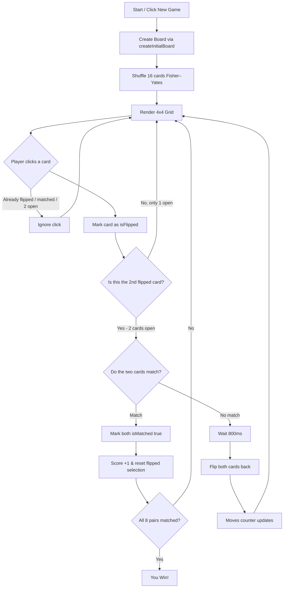
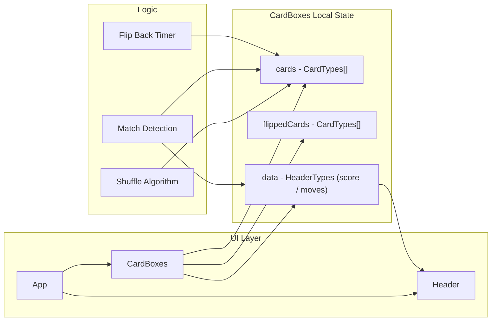

<div align="center">

# Memory Card Game

**A sleek, animated card-matching game built with React 19, TypeScript & Tailwind CSS v4**


Test your memory and concentration with this classic matching game! Flip over the cards, find all 8 matching pairs of fruit emojis, and watch your score climb.

</div>

---

## Table of Contents

- [Features](#features)
- [Live Demo](#live-demo)
- [Tech Stack](#tech-stack)
- [Project Structure](#project-structure)
- [How It Works](#how-it-works)
- [Game Flow](#game-flow)
- [Component Breakdown](#component-breakdown)
- [Installation](#installation)
- [Available Scripts](#available-scripts)
- [How to Play](#how-to-play)
- [Type System](#type-system)
- [Future Improvements](#future-improvements)
- [License](#license)

---

## Features

- **16 Cards** shuffled randomly on every new game (8 matching pairs)
- **Fisher–Yates Shuffle** algorithm for truly random card ordering
- **Smooth flip & hover animations** with 3D-feel hover scales
- **Live match detection** — matched cards stay revealed in green
- **Auto-flip back** unmatched pairs after 800ms
- **Real-time Score & Moves** counters in the header
- **Dark glassmorphism UI** with Tailwind CSS v4
- **Optimized with React 19** lazy state initialization (no `useEffect` for setup)
- **Fully typed** with TypeScript

---

## Live Demo

> **Play it live:** [https://memory-game-kohl-sigma.vercel.app](https://memory-game-kohl-sigma.vercel.app)

---

## Tech Stack

| Layer      | Technology                                        |
| ---------- | ------------------------------------------------- |
| Framework  | [React 19.2](https://react.dev/)                  |
| Language   | [TypeScript 6.0](https://www.typescriptlang.org/) |
| Styling    | [Tailwind CSS v4](https://tailwindcss.com/)       |
| Build Tool | [Vite 8.2](https://vitejs.dev/)                   |
| IDs        | `crypto.randomUUID()` (native, no UUID lib)       |

---

## Project Structure

```
memory-game/
├── public/
│   └── favicon.svg
├── src/
│   ├── components/
│   │   ├── CardBoxes.tsx      # Container: composes header, board & win screen
│   │   ├── Header.tsx         # Score, moves & "New Game" button
│   │   ├── GameBoard.tsx      # Grid that renders each GameCard
│   │   ├── GameCard.tsx       # Single flip-card UI (button + styles)
│   │   └── WinMessage.tsx     # Win overlay with score/moves & Play Again
│   ├── hooks/
│   │   └── useMemoryGame.ts   # All game state & rules (custom hook)
│   ├── utils/
│   │   ├── types.ts           # Shared TypeScript types
│   │   └── gameLogic.ts       # Card values + createInitialBoard (pure)
│   ├── App.tsx                # Root component
│   ├── main.tsx               # Entry point
│   └── index.css              # Tailwind + global styles
├── index.html
├── package.json
├── tsconfig.json
├── vite.config.ts
├── eslint.config.js
└── README.md
```

---

## How It Works

The game is split into a **stateful custom hook** and **presentational components**:

1. **`useMemoryGame`** (hook) — owns all state: `cards`, `flippedCards`, and `data` (score & moves), plus the game rules.
2. **`CardBoxes`** (container) — calls the hook and composes `<Header>`, `<GameBoard>`, and `<WinMessage>`.
3. **`GameBoard` / `GameCard`** (UI) — render the 4×4 grid with no game logic.

Each card is a `CardTypes` object with an id, a fruit emoji, and two boolean flags.

---

## Game Flow



---



---

## Component Breakdown

### `App.tsx`

The root of the app — currently just wraps `CardBoxes`, keeping the structure ready for future expansion (global context, routing, etc.).

### `useMemoryGame.ts` _(state & rules)_

- Creates & shuffles the board via **lazy state initialization** to avoid `useEffect`:
  ```tsx
  const [cards, setCards] = useState<CardTypes[]>(createInitialBoard);
  ```
- `handleToggleFlipped(id)`:
  1. Ignores clicks on already-flipped/matched cards or when 2 cards are open
  2. Flips the selected card
  3. On the 2nd card, checks a match
  4. Marks matches green, or auto-flips back after 800ms on a mismatch
- `handleNewGame()` resets the board, selection, score and moves.

### `CardBoxes.tsx` _(container)_

Pulls everything from `useMemoryGame` and renders `<Header>`, `<GameBoard>` and (when won) `<WinMessage>`.

### `GameCard.tsx` & `GameBoard.tsx` _(UI)_

`GameBoard` renders the 4×4 grid and maps each card to a `GameCard`. `GameCard` is a single button that shows the emoji when flipped/matched, otherwise a question mark.

### `WinMessage.tsx`

Celebration overlay shown when all pairs are matched — animated trophy, falling confetti, the final score/moves, and a **Play Again** button.

### `Header.tsx`

Displays `score` and `moves` in a polished card beside the title, plus a **"New Game"** button that receives extra props via spread.

---

## Installation

> **Prerequisites:** [Node.js](https://nodejs.org/) 18+ and npm (or pnpm / yarn).

```bash
# 1. Clone the repository
git clone https://github.com/ahmadabdallahh/memory-game.git
cd memory-game

# 2. Install dependencies
npm install

# 3. Start the dev server
npm run dev
```

Open [http://localhost:5173](http://localhost:5173) in your browser.

---

## Available Scripts

| Command           | Description                          |
| ----------------- | ------------------------------------ |
| `npm run dev`     | Start the Vite development server    |
| `npm run build`   | Type-check + build for production    |
| `npm run preview` | Preview the production build locally |
| `npm run lint`    | Run ESLint on the codebase           |

---

## How to Play

1. Click **New Game** to shuffle the board.
2. Click any card to flip it and reveal the fruit emoji.
3. Flip a **second** card — if the two fruits match, they stay revealed.
4. If they don't match, they flip back automatically after a short delay.
5. Match all **8 pairs** to win — the fewer moves, the better your score!

---

## Type System

```ts
// src/utils/types.ts
type HeaderTypes = {
  score: number;
  moves: number;
  onClick?: () => void;
};

type CardTypes = {
  id: string;
  item: string;
  isFlipped: boolean;
  isMatched: boolean;
};

type WinMessageProps = {
  score: number;
  moves: number;
  onPlayAgain: () => void;
};
```

| Field       | Purpose                                   |
| ----------- | ----------------------------------------- |
| `id`        | Unique identifier (`crypto.randomUUID()`) |
| `item`      | The fruit emoji shown when flipped        |
| `isFlipped` | Whether the card is face-up               |
| `isMatched` | Whether the pair has been matched         |

---

## Future Improvements

- [ ] Timer & difficulty levels (6×6 grid, themes)
- [ ] Move counter + score persistence with `localStorage`
- [ ] Sound effects & flip animations using CSS 3D transforms
- [ ] Leaderboard using a backend or local storage
- [ ] Accessibility improvements (ARIA labels, keyboard navigation)

---

## License

This project is open source and available under the **MIT License**.

---

<div align="center">
  Made with "Ahmad Abdallah" — Happy matching!
</div>
